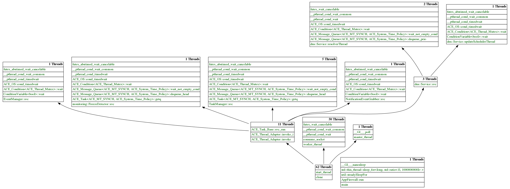

# Parallel stacks

## Quick Start

Get

    git clone
    cd parallel-stacks

Install dependencies

    pip3 install -r requirements

Get parallel stacks from a running process

    python3 parallel-stacks.py --pid 12345

## Help

    python3 parallel-stacks.py -h

## Example 1 (for GDB 9.1 or above)

    # Attach to a process. For example, the process have a PID 12345.
    $ gdb -p 12345

    # Run the script and pass backtraces for all threads.
    (gdb) pipe thread apply all bt | python3 parallel-stacks.py

## Example 2 (for GDB below 9.1)

    # Attach to a process. For example, the process have a PID 12345.
    $ gdb -p 12345

    # Enable logging to a file.
    (gdb) set logging overwrite on
    (gdb) set logging on

    # Get backtraces for all threads
    (gdb) thread apply all bt

    # Run the script and pass a gdb.txt file.
    (gdb) shell python3 parallel-stacks.py -f gdb.txt

    # Disable logging
    (gdb) set logging off

    # Repeat if you want
    (gdb) set logging on
    (gdb) thread apply all bt
    (gdb) shell python3 parallel-stacks.py -f gdb.txt
    (gdb) set logging off
