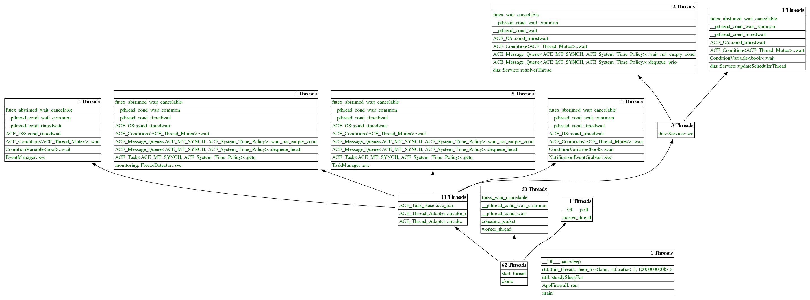

# Parallel stacks

Parallel Stacks VS Code extension is published at:

Parallel Stacks is a project for visualizing thread stack traces as a merged graph.

## Project Structure

### 1. `threads-merger` (C++)

Core library that accepts thread stacks and builds a graph from them.

- Includes the `threads-merger-cli` utility for local usage and testing.
- Documentation: [threads-merger/README.md](threads-merger/README.md)

### 2. VS Code extension

Extension that integrates `threads-merger` compiled to WebAssembly and renders stack graphs directly in VS Code.

- Location: `vscode-ext/parallel-stacks`
- Documentation: [vscode-ext/parallel-stacks/README.md](vscode-ext/parallel-stacks/README.md)

### 3. Legacy Python utility

`parallel-stacks.py` parses GDB output and builds a graph, but this tool is outdated and is no longer the main direction of development.

- Script: `parallel-stacks.py`
- Dependencies for legacy script: `requirements.txt`

### 4. `examples`

Directory with sample stack scenarios for experiments and debugging.

- `examples/cpp`: C++ programs with different call stack patterns (including a stack overflow case).
- `examples/python`: Python example that can be used to produce sample stacks.

## Legacy Python Utility Usage

Clone and install dependencies:

    git clone https://github.com/bravikov/parallel-stacks.git
    cd parallel-stacks
    pip3 install -r requirements.txt

Show help:

    python3 parallel-stacks.py -h

Get parallel stacks from a running process:

    python3 parallel-stacks.py --pid 12345

Example for GDB 9.1+:

    # Attach to a process. For example, the process has PID 12345.
    $ gdb -p 12345

    # Run the script and pass backtraces for all threads.
    (gdb) pipe thread apply all bt | python3 parallel-stacks.py

Example for GDB below 9.1:

    # Attach to a process. For example, the process has PID 12345.
    $ gdb -p 12345

    # Enable logging to a file.
    (gdb) set logging overwrite on
    (gdb) set logging on

    # Get backtraces for all threads.
    (gdb) thread apply all bt

    # Run the script and pass a gdb.txt file.
    (gdb) shell python3 parallel-stacks.py -l gdb.txt

    # Disable logging.
    (gdb) set logging off
